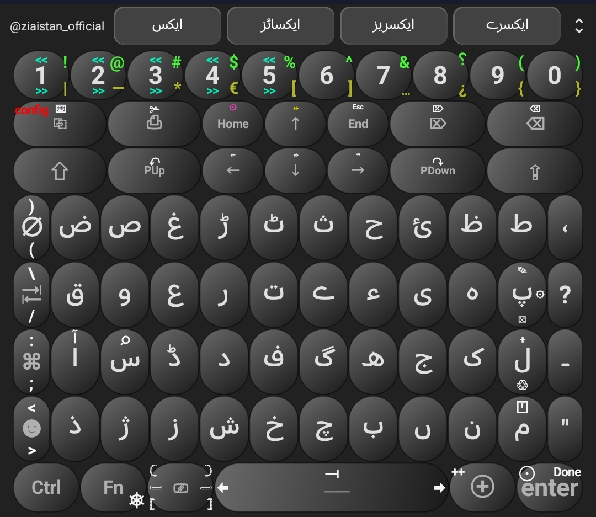
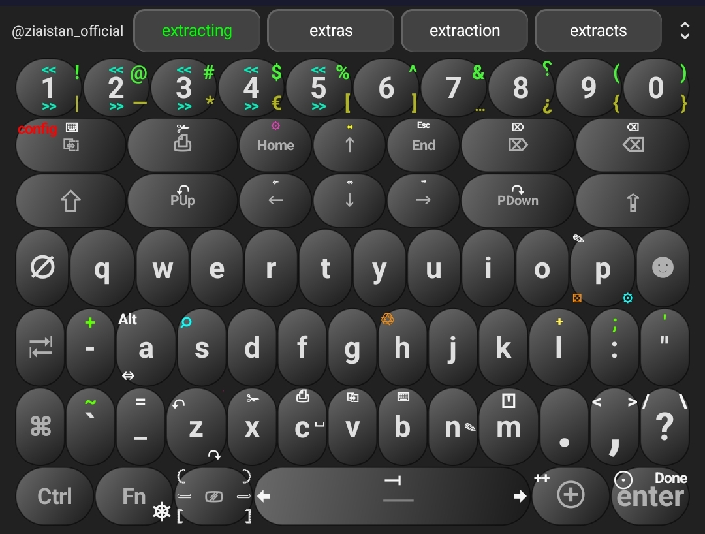
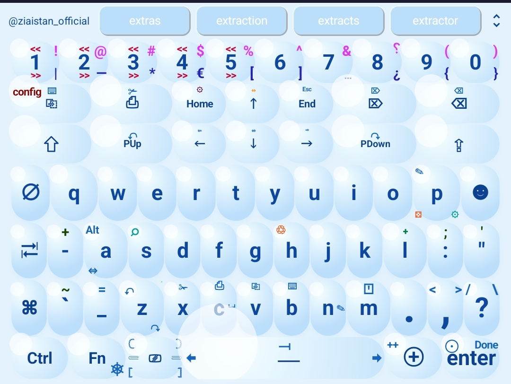
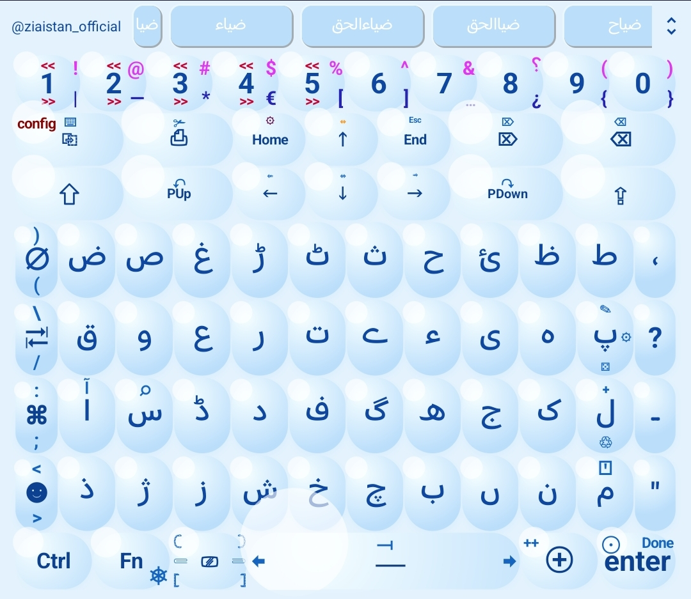
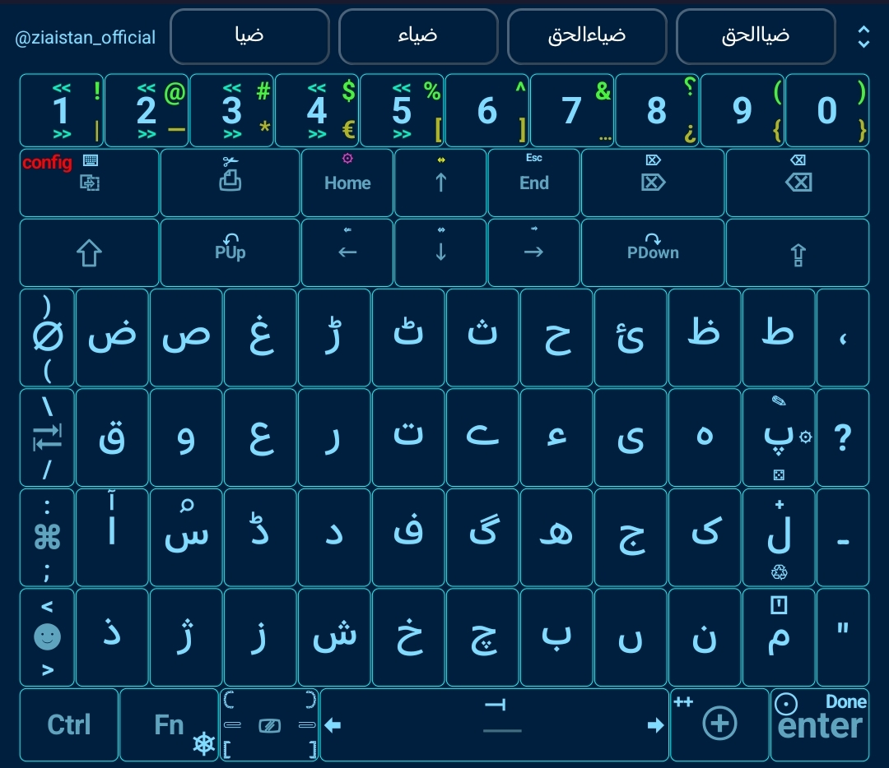
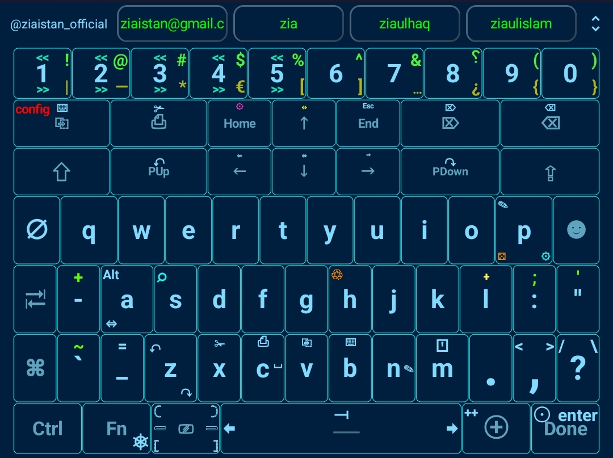
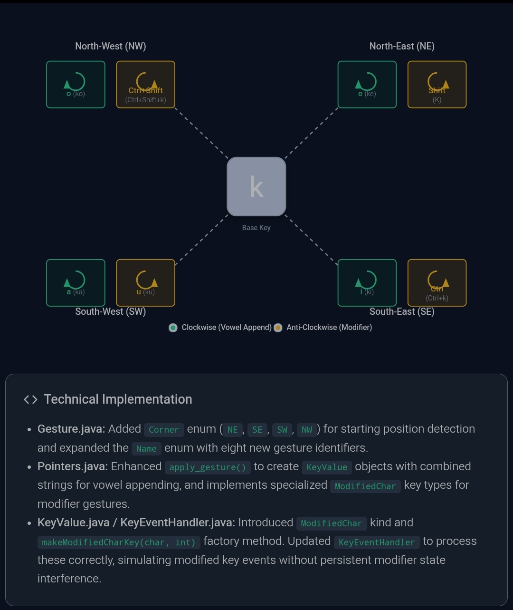

# Ziaistan Keyboard

## Overview

Ziaistan Keyboard is a lightweight, privacy-centric virtual keyboard application for Android devices. Originating as a personal fork of Unexpected Keyboard, it has been extensively modified to create a powerful typing solution that prioritizes user privacy, productivity, and deep customization.

### Core Philosophy
The application operates on a fundamental principle: **complete user privacy**. It contains no advertisements, makes zero network requests, and is fully open-source. All data processing occurs locally on the device, ensuring sensitive information never leaves your control.

### Primary Use Case & Gesture System
While originally designed for programmers utilizing Termux, the keyboard has evolved into a versatile everyday input method. Its hallmark is the **gesture-based input system**, which expands functional capacity without cluttering the interface. Each key contains up to four corner positions. By sliding your finger from a key's center toward a corner (e.g., swiping lower-left for Settings), you can access additional characters, symbols, and macros.

---

## Auto-Correction Engine

A sophisticated, keyboard-aware auto-correction system identifies and rectifies typographical errors in real-time without impeding typing flow.

### Core Mechanics
- **Activation:** Triggers automatically upon pressing the spacebar after word completion.
- **Keyboard-Aware Algorithm:** Understands physical key adjacency (e.g., recognizing 'o' neighbors 'i' and 'p' on QWERTY) to prioritize spatial corrections.
- **Correction Reversal:** Mistaken corrections can be reverted with a single backspace press.

### Multi-Algorithm Suite
The system utilizes background thread pools to process multiple correction algorithms simultaneously:
- **Substitution:** Wrong-key presses ("tets" → "test")
- **Deletion:** Extraneous characters ("heello" → "hello")
- **Insertion:** Missing characters ("hallo" → "hello")
- **Transposition:** Swapped adjacent characters ("teh" → "the")
- **Reversal:** Completely reversed words
- **Doubling/Singling:** Doubled or single-letter errors

### Smart Revert System
- **Temporary Suspension:** If you manually reverse a correction via backspace, the keyboard remembers this and suspends auto-correction for that specific word during the current sentence.
- **Re-enablement:** Deleting and retyping the word reactivates the engine for future instances.

---

## Backup, Restore, and Data Synchronization

A future-proof infrastructure safeguards user configurations, linguistic models, and personal data across devices.

### Automatic Sync and Restore
- **Real-Time Local Backup:** Dictionary additions, clipboard items, and learned phrases are instantly exported to `Downloads/ziaistan_keyboard_backup/`.
- **Google Drive Integration:** If signed in, changes sync to the cloud in real-time.
- **Cross-Device Restore:** On a new installation, the app scans local and cloud storage, automatically pulling and intelligently merging `_en` and `_ur` data files without overwriting existing entries.

### Managed Data Files
The system manages language-specific and global files:
- `custom_en.txt` / `custom_ur.txt`: Personalized dictionary words.
- `suggestion_filters_en.json` / `suggestion_filters_ur.json`: Promoted, demoted, and blacklisted suggestions.
- `next_word_prob_en.txt` / `next_word_prob_ur.txt`: Learned statistical n-gram models.
- `typed_en.txt` / `typed_ur.txt`: Recently typed words.
- `clipboard_export.json`: Complete clipboard history.
- `keyboard_backup_timestamp.json`: Full settings snapshot.

### Manual Operations & Advanced Merging
- **Full Backup/Restore:** Navigate to **Settings > Backup & Restore** to create timestamped JSON snapshots or revert the entire keyboard state.
- **Manual File Editing:** Located in **Settings > Behavior > Custom Dictionary > Manual File Editing**. Allows power users to drill down into JSON structures and import compatible files using a non-destructive merge algorithm.


## Clipboard System

A completely refactored, grid-based clipboard manager with advanced search and gesture controls.

### Interface and Gestures
- **Modern Design:** Fluid `RecyclerView` grid with theme-aware `CardView` containers.
- **Tap:** Pastes content at the cursor.
- **Long-Press:** Pins/unpins items (pinned items move to the bottom in chronological order).
- **Swipe Left:** Archives items with a timestamp and content preview.
- **Swipe Right:** Deletes items with a 25-second "Undo" recovery option.
- **Search Integration:** Dedicated top search bar with real-time filtering, term highlighting, and asynchronous performance for large histories.

### Management
- **Import/Export:** Full history export/import via JSON with duplicate prevention.
- **Renaming:** Archived items can be renamed via an overlay interface.
- **Navigation:** Dedicated back button and proper system navigation bar integration. Enabled by default in **Settings > Clipboard**.

---

## Custom Dictionary Management

Create and maintain personalized dictionaries (`custom_en.txt` / `custom_ur.txt`) for prioritized suggestions.

### Addition Methods
- **Real-Time (Single/Phrase):** Select text (up to 5 words) and press the **'⊕'** key or **"add to dictionary"** button. The system converts to lowercase, adds to the active language file, and prevents duplicates.
- **Batch Addition:** Swipe top-left to the **"++"** button. Processes selected text blocks with advanced sanitization (word splitting, lowercase conversion, single-letter exclusion).
- **Manual Import/Export:** Access via **Settings > Behavior > Custom Dictionary** to load or save `.txt` files.

### Layout Integration
Add a dedicated dictionary button to any custom XML layout:
```xml
<key key0="add_to_dictionary"/>
```

---

## Emoji Panel ☻

A comprehensive emoji and kaomoji management system.

- **Favorites & Recents:** Long-press to mark favorites; automatic tracking of recently used emojis.
- **Customization:** Independent size adjustments, configurable column counts (portrait/landscape), and toggleable tabs.
- **Management:** Clear history, reset favorites, and configure vibration/sound feedback.

---

## Keyboard Layouts and Live Customization

### Standard Layouts
- **English QWERTY (`latn_qwerty_us.xml`):** Features two dedicated function rows (navigation, editing, history), a multi-modifier shift key (ctrl, alt, meta via corner swipes), and standard/custom symbol access via the **⌘** key.
- **Urdu Phonetic (`urdu_phonetic_ur.xml`):** Includes corner-swipe diacritics (`zabbar`, `zer`, `pesh`) on every key, eliminating the need for a separate menu. Maintains identical function rows and modifier logic for cross-language consistency.

## Keyboard Layouts








### Live Layout Customization (Pro Feature)
Accessible via **Settings > Style > Live Layout Customization**:
- **Visual Editing:** Tap to edit, long-press to drag-and-drop.
- **Multi-Layer Gestures:** Assign characters/macros to Side Swipes, Circles, and Anti-Circles.
- **Macro Engine:** "Append" mode creates multi-action macros (e.g., Select All + Delete).
- **Glyph Integration:** Dedicated tab for icons/math glyphs. "Auto Glyphs" maps standard actions to visual icons.
- **Auto-Surroundings:** Calculates physical adjacency maps for hyper-accurate auto-correction.
- **Import/Export:** Share layouts as XML files with embedded surroundings and themes.

---

## Key Visuals, Pop-ups, and Icon Colors

### Key-press Pop-ups
- **Accurate Display:** Shows the final character accounting for taps, swipes, and modifiers (e.g., Ctrl+Shift).
- **Design:** Theme-aware coloring, centered 4x key width dimensions, 500ms duration, and instant no-animation appearance for rapid feedback.

### Per-Side-Key Icon Colors
Granular RGB color control for individual swipe-direction icons with automatic theme adaptation:
```xml
<key c="a" w="b"
     w_color_dark="255,182,193"
     w_color_light="139,0,0"/>
```
Supports all 8 directions (`n`, `s`, `e`, `w`, `nw`, `ne`, `sw`, `se`).

---

## Mouse Pad / Trackpad

Transform the keyboard into a laptop-style trackpad for precise cursor control.

### Activation and Controls
- **Launch:** Swipe **Up / North-West** on the **'m'** key.
- **Movement & Clicks:** Slide for cursor movement, single tap for left click, double-tap/triple-tap for right click, double-tap-and-hold for drag.
- **Magnifier:** Built-in zoom tool for pixel-perfect clicking.

### Interface Management
- **Adjustments:** Drag the title bar to move, bottom-right handle to resize, and minimize button to collapse into a floating bubble.
- **Customization:** Adjustable cursor speed, sensitivity, size, and semi-transparent background.
- **Permissions:** Requires "Display over other apps" and "Accessibility Service".

---

## Password Manager Integration

An enterprise-grade, zero-knowledge password vault integrated directly into the keyboard.

### Security Architecture
- **Encryption:** Local database utilizing **AES-256-GCM** for confidentiality and integrity.
- **Master Password:** Secured via PBKDF2 with HMAC-SHA256 (100,000 iterations). Never stored on the device.
- **Biometrics:** Fingerprint authentication tied to Android Keystore (`invalidatedByBiometricEnrollment=true`), auto-invalidating upon new fingerprint enrollment.
- **Auto-Locking:** Session-based security locks the vault when the app closes or backgrounds.

### Vault Features
- **Generator:** Cryptographically strong passwords with customizable length (default: 40) and character sets (including emojis/multilingual).
- **Management:** Universal search, multi-select bulk deletion, and bit-by-bit deduplication.
- **Icons:** Manual gallery assignment (Base64 encoded), automated web fetching (Google Favicon API), and app icon resolution via `PackageManager`.
- **Backups & Migration:** Encrypted archive backups and robust CSV import with header mapping.

### Keyboard Shortcuts (via 'p' key)
- **South-East (⚙):** Opens vault.
- **South-West (⚄):** Triggers password generator.
- **North-West (✎):** Activates autofill with **Sequential Pasting** (Username → TAB → Password) utilizing an IME-level action queue.

---

## Predictive Text and Suggestion Engine

An advanced n-gram predictive engine that adapts to individual typing patterns.

### Core Capabilities
- **Contextual Awareness:** Tracks up to 3-word context sequences.
- **Language Isolation:** Automatically switches between English (`_en`) and Urdu (`_ur`) data files to prevent cross-language contamination.
- **Real-Time Learning:** Learns from natural typing, suggestion selections, and manual training (swipe up on **'l'** with text selected).

### Suggestion Strip Gestures
- **Swipe Up:** Promotes and pins the word to the start of the strip.
- **Swipe Down:** Demotes the word to the end of the list.
- **Long-Press:** Blacklists the word permanently.
- *Includes interactive animations and advanced touch interception to prevent RecyclerView conflicts.*

### Scoring and Ranking Hierarchy
Suggestions are ranked by Search Type (Prefix → Keyboard-Aware → Layout-Aware Corrections) and then by Source File Priority:
1. Recently Typed (`typed_en.txt` / `typed_ur.txt`)
2. Suggestion Filters (`suggestion_filters_en.json` / `suggestion_filters_ur.json`)
3. Next-Word Probabilities (`next_word_prob_en.txt` / `next_word_prob_ur.txt`)
4. Custom Dictionary (`custom_en.txt` / `custom_ur.txt`)
5. Common Words (`common_en.txt` / `common_ur.txt`)
6. Main Wordlist (`wordlist_en.txt` / `wordlist_ur.txt`)

*Categories can be color-coded in **Settings > Behavior > Auto Suggestions Customizations**.*

---

## Search and Replace Tool

A universal text and clipboard search utility.

- **Access:** Swipe **North-West** on the **'s'** key.
- **Text Features:** Find, Replace, Replace All, match navigation, Case Sensitivity, Whole Word, and Regex support.
- **Clipboard Mode:** Switch modes to search and insert items from your clipboard history or typing sessions with real-time filtering.

---

## Settings, Shortcuts, and Configuration

### Productivity & App Shortcuts
- **'h' (NW Swipe):** Typing History.
- **'z' (NW/SE Swipe):** Undo / Redo.
- **'x', 'c', 'v' (Up Swipe):** Cut, Copy, Paste.
- **'n' (Right Swipe):** Secure Notes (Vault) or Quick Notes (no-auth).
- **'c' (Right Swipe):** Termux Command Palette (loads from `termux-commands.json`, 100+ default commands).
- **'t', 'k', 'o', 'c':** Google Translate, Google Keep, Obsidian, Chrome Web Search.

### Learning Shortcuts
- **'l' (Up Swipe):** Learn selected text as next-word probability.
- **'⊕' (Click):** Add selected text (1-3 words) to `custom_en.txt` / `custom_ur.txt`.
- **'++' (NW Swipe):** Bulk add selected text to custom dictionaries.

### UI and Behavior
- **Suggestion Strip Positioning:** Toggle top/bottom placement via handle arrows or **Settings > Behavior**.
- **Gesture Trail:** Visual finger trail during swipes (swipe-to-type disabled to prevent conflicts).
- **Preferences:** Swap Enter/Action keys, Double Space Period, Bold Key Text, Show/Hide Sublabels, System Font, Vibrate/Sound feedback.

---

## Side Panel Navigation

A customizable edge-swipe system for instant access to apps and system actions.

- **Activation:** Enable in **Settings > Side Panel Navigation**. Swipe inward from Left, Right, or Bottom edges.
- **Navigation:** Drag parallel to switch tabs, perpendicular to highlight actions, release to execute.
- **Animations:** Classic, Pop-up, Stealth, Neon, Fish Eye, Playful.
- **Actions:** Launch apps, toggle system settings (Wi-Fi, Bluetooth), simulate media keys, global navigation (Back, Home), or "Killer Features" (force close foreground/background apps).

---

## Text Manipulation, Formatting, and Editing

### Selection Formatting
When text is selected, type the following keys to manipulate it:
- **Bold / Italic:** `b` / `i`
- **Case:** `u` (UPPER), `l` (lower), `s` (Sentence)
- **Font Size:** Two-digit number (e.g., `24`)
- **Encapsulation:** `{}`, `[]`, `()`, `<>`, `"`, `'`, `/`, `\` (e.g., `hello` + `[` → `[hello]`)

### Universal Editing & Navigation
- **Universal Operations:** Built-in Undo/Redo, Cut/Copy/Paste, and smart word deletion for apps lacking native support.
- **Word Jumping:** Swipe **Up** (backward) or **Down** (forward) on number keys **1-5** to move the cursor by the corresponding word count.

---

## Themes and Visual Customization

### Procedural Theme System
Over **25+ procedural themes** rendered dynamically via gradients, noise patterns, and shaders, ensuring crisp visuals without bloating app size.
- **Categories:** Material/Natural (Water, Wood, Metal), Cyberpunk (Neon, Matrix, Synthwave), Geometric (Hexagon, Gem, Puzzle).
- **Standard Themes:** System, Ocean, Forest, Sunset, Midnight, Galactic, Golden Pearl, ePaper, etc.

### Theme Switching Key
- **Icon:** ⎚ (Bottom row)
- **Tap:** Cycles through 6 predefined themes.
- **Swipe:** Side-swipe left/right for granular dark/light variant selection. Applies instantly.

---

## Tutorial System

A dynamic educational system that utilizes empty suggestion strip space.

- **Context-Aware:** Displays tips when no word suggestions are available.
- **Library:** 80+ tutorials covering basic to advanced features, auto-rotating every 5 seconds.
- **Manual Nav:** Swipe left/right to pause rotation and read.
- **Adding Tutorials:** Edit `res/values/arrays.xml` and add to `<string-array name="tutorials">`. (Escape apostrophes with `\'`).

---

## Typing History

A locally-maintained, encrypted log of your typing sessions.

- **Capacity:** Expanded to **10,000 items** with robust session management across text field switches.
- **Access:** Swipe **North-West** on the **'h'** key.
- **Features:** View recent entries, copy to clipboard, restore to active fields. 100% local storage with zero network transmission.

---

### Typing Hud:
- **Floating & Draggable Overlay:** The HUD is a true system-level overlay using `WindowManager`. You can **drag and drop** the HUD to any position on your screen, and it will remember that position as the new default.
- **Modern Aesthetic:** redsigned with separate rounded bubbles for each word, using bold text and a semi-transparent black background (customizable) for a premium look.
- **Dynamic Transition Logic:** 
  - **As You Type:** The current word appears briefly on the left for real-time feedback.
  - **On Completion:** Pressing space or selecting a suggestion moves the word to the right side with an arrow, confirming your input.
  - **On Correction:** Misspelled words appear on the left with their corrected versions on the right.
- **Full Customization (Settings > Behavior):**
  - **Toggle:** Enable or disable the feature.
  - **Duration:** Adjust how long the HUD stays visible (defaults to 3 seconds for completions).
  - **Colors:** Fully customize the Background and Text colors using ARGB Hex values.
  - **Size:** Adjust the text size to your preference.
- **Privacy & Context Awareness:**
  - **Password Shield:** The HUD is automatically disabled in password fields and other sensitive inputs.
  - **Paste Protection:** The HUD immediately hides and stays suppressed when you paste text from the clipboard, history, or password manager.
- **Stability and Performance:** Optimized for thread-safety and robust lifecycle management to ensure a smooth, crash-free experience. Includes automatic detection of the "Display over other apps" permission.


## Voice Input

A redesigned dictation overlay with comprehensive editing tools.

- **Controls:** Tap mic to toggle listening. Visual status indicators ("Listening...", "Tap to Speak").
- **Smart Punctuation:** Auto-inserts periods/commas or recognizes spoken commands ("Period", "New Line").
- **Editing Tools:** Dedicated Undo/Redo, character/word cursor navigation, swipe-based text selection, and specialized deletion commands (Delete Word/Sentence).
